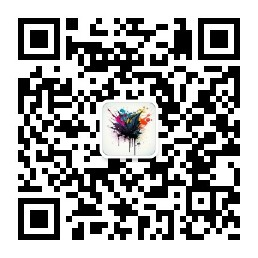
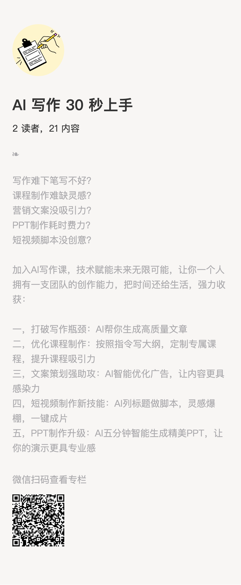

### About Me 

Software engineer , System Architect , Product Manager , Starup , More than 16 years' related experience.

> Studied in NCWU，Adrift in Beijing，now living in ChangSha.

### 我的公众号

### 我的专栏

我不推荐你去学元宇宙、Web3或者区块链，这些离你我这样的普通人都太远，但Al不同，它是一个生产力工具，能够切实的解决你日常工作生活中遇到的问题，提高工作效率。Al不会取代你，取代你的是比你更会使用AI的人。善用Al的人，背后就如同有了一个团队，他/她的能力在被不断放大。

人们喜欢在短期高估一项技术的价值，长期却又低估一项技术的价值，对AI也一样。

.png)

### GitChat技术专栏
[Spring Cloud Alibaba 微服务开发实战](https://xiaozhuanlan.com/msa-practice)

### 开源项目

1. [https://github.com/backkoms/web-api-demo](https://github.com/backkoms/web-api-demo)
2. [https://github.com/backkoms/web-service-demo](https://github.com/backkoms/web-service-demo)
3. [基于SpringCloud的微服务架构实战案例项目](https://github.com/backkoms/simplemall)
4. [改造后的mybatis-generator生成中文注释](https://github.com/backkoms/mybatis-generator-comments)
